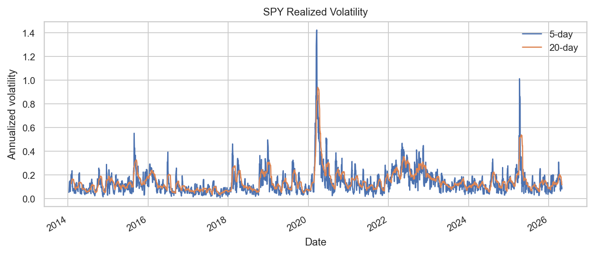
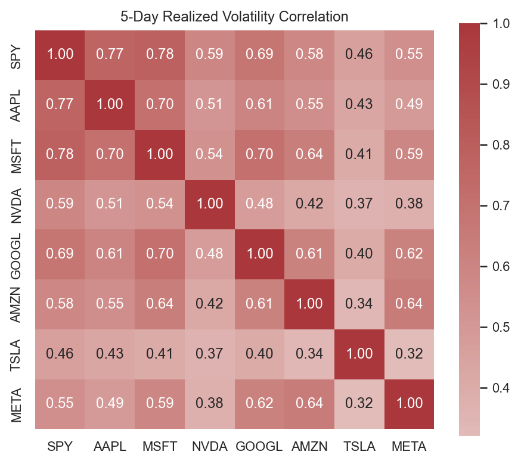
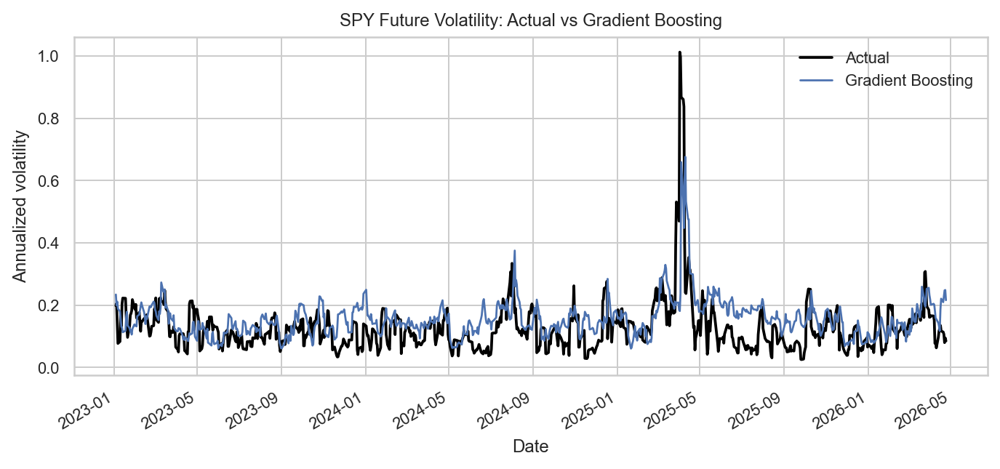
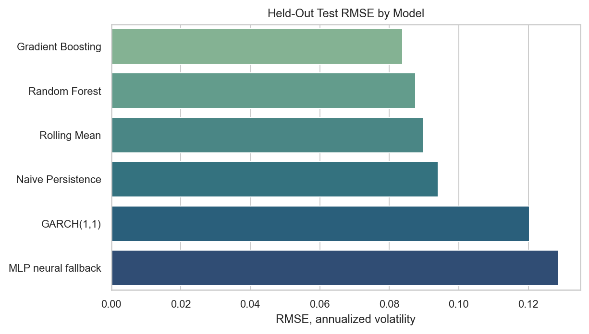
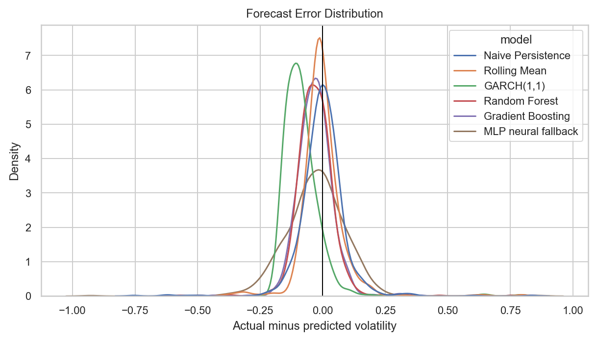
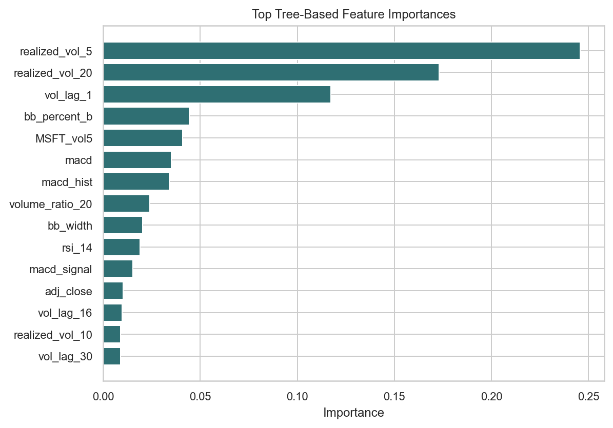
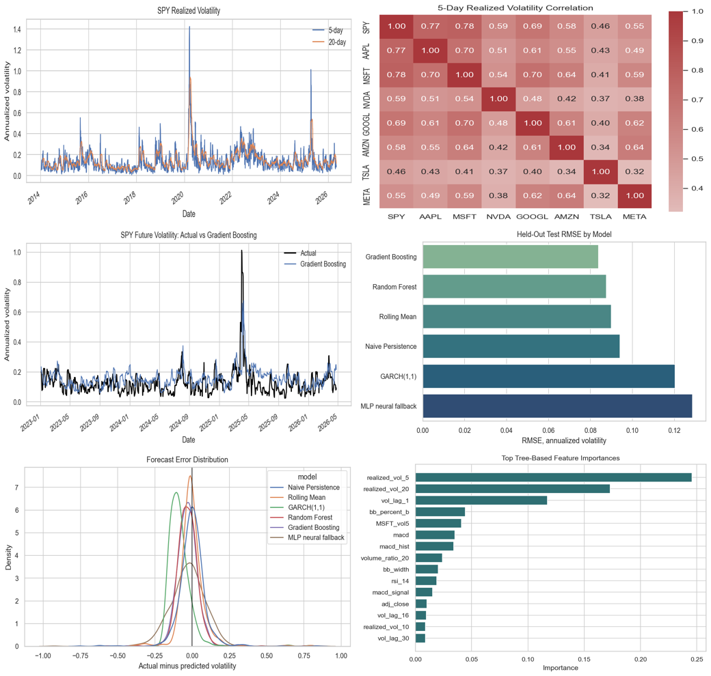

# Predicting Short-Term Stock Market Volatility Using Time Series and Machine Learning Models

Author: Mehul Khajuria  
NetID: mk2147  
Section ID: 8  
Department of Computer Science, Rutgers University--New Brunswick

This project forecasts short-term SPY realized volatility using public Yahoo Finance daily OHLCV data and a reproducible machine learning pipeline. The raw data are public; the original project contribution is the leakage-safe target construction, feature engineering, model comparison, generated figures, evaluation metrics, and final analysis.

Code: `https://github.com/mehulkhajuria/stock-volatility-forecasting-final`  
Video: `https://drive.google.com/file/d/1WHrb_cmfUd0r3vPYM631zReFNjM5q4A_/view?usp=sharing`  
Final paper: [paper/final_project.pdf](paper/final_project.pdf)

## Abstract

The project predicts future 5-day realized volatility for SPY from 2014-01-01 through the most recent available trading date in the local run, 2026-04-24. Features include adjusted-close log returns, rolling realized volatility, 30 days of return and volatility lags, rolling volume ratios, RSI, Bollinger Band features, MACD features, and volatility context from AAPL, MSFT, NVDA, GOOGL, AMZN, TSLA, and META. Models are evaluated with chronological train/validation/test splits and no random shuffling.

## Dataset

- Source: Yahoo Finance through `yfinance`
- Frequency: daily OHLCV
- Target symbol: SPY
- Context symbols: AAPL, MSFT, NVDA, GOOGL, AMZN, TSLA, META
- Date range requested: 2014-01-01 through latest available
- Actual latest date in this run: 2026-04-24
- Train: through 2021-12-31
- Validation: 2022-01-01 through 2022-12-31
- Test: 2023-01-03 through 2026-04-24

The target at date `t` is future 5-day realized volatility, computed from returns `t+1` through `t+5`. Feature rows use only data available through `t`.

## Models

| Model | Implementation note |
|---|---|
| Naive persistence | Predicts future volatility equals current 5-day volatility |
| Rolling mean | Mean of the previous 20 volatility lags |
| GARCH(1,1) | `arch`, fit on train plus validation SPY returns |
| Random Forest | `sklearn.ensemble.RandomForestRegressor` |
| Gradient Boosting | XGBoost `XGBRegressor` |
| MLP neural fallback | TensorFlow/PyTorch LSTM attempted; Python 3.13 environment lacked both, so results use deterministic MLP fallback |

## Results

Held-out SPY test period: 2023-01-03 through 2026-04-24.

| Model | MSE | MAE | RMSE | Directional accuracy | Runtime seconds |
|---|---:|---:|---:|---:|---:|
| Gradient Boosting | 0.0070 | 0.0583 | 0.0839 | 0.6687 | 0.73 |
| Random Forest | 0.0077 | 0.0587 | 0.0875 | 0.6518 | 24.19 |
| Rolling Mean | 0.0081 | 0.0525 | 0.0899 | 0.6892 | 0.00 |
| Naive Persistence | 0.0088 | 0.0582 | 0.0941 | NA | 0.00 |
| GARCH(1,1) | 0.0145 | 0.0999 | 0.1204 | 0.5530 | 0.07 |
| MLP neural fallback | 0.0165 | 0.0931 | 0.1286 | 0.5952 | 0.49 |

Gradient Boosting had the best RMSE. The rolling mean baseline had the best MAE and best defined directional accuracy, which is a useful reminder that simple volatility persistence is a strong benchmark. Naive persistence predicts no directional change by construction, so directional accuracy is reported as NA rather than a meaningful score.

## Figures















## Installation

Python 3.13 was used for this run.

```powershell
python -m pip install -r requirements.txt
```

Conda users can also create the environment:

```powershell
conda env create -f environment.yml
conda activate stock-volatility-final
```

## Reproduce Everything

```powershell
python -m src.run_all
```

This downloads/caches raw data in `data/raw/`, writes processed features in `data/processed/`, saves metrics in `results/`, and regenerates figures in both `figures/` and `paper/figures/`.

## Repository Structure

```text
.
├── README.md
├── requirements.txt
├── requirements-lock.txt
├── environment.yml
├── LICENSE
├── video_script.md
├── demo_checklist.md
├── data/
├── figures/
├── results/
├── src/
└── paper/
```

## Limitations

This is not financial advice. The project uses daily public market data only and does not include intraday prices, options-implied volatility, news, macroeconomic events, or transaction-cost analysis. GARCH is fit once rather than refit in a walk-forward loop. A true LSTM result is not reported because TensorFlow and PyTorch were not available in the local Python 3.13 environment.

## Before Submission

Replace `mehulkhajuria` in:

- `README.md`
- `paper/main.tex`

Replace `https://drive.google.com/file/d/1WHrb_cmfUd0r3vPYM631zReFNjM5q4A_/view?usp=sharing` in:

- `README.md`
- `paper/main.tex`

After replacing either paper URL, recompile:

```powershell
cd paper
latexmk -pdf main.tex
Copy-Item main.pdf final_project.pdf -Force
```
